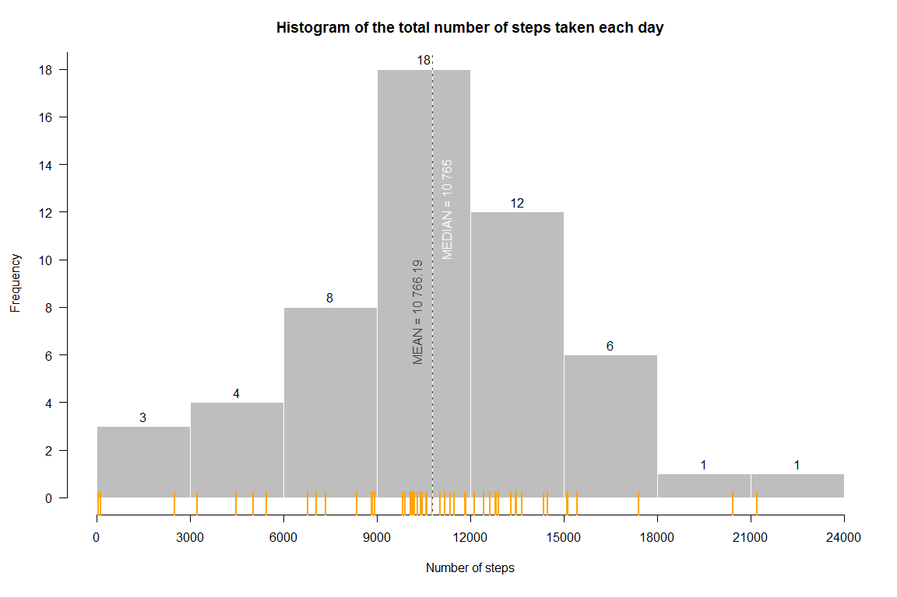
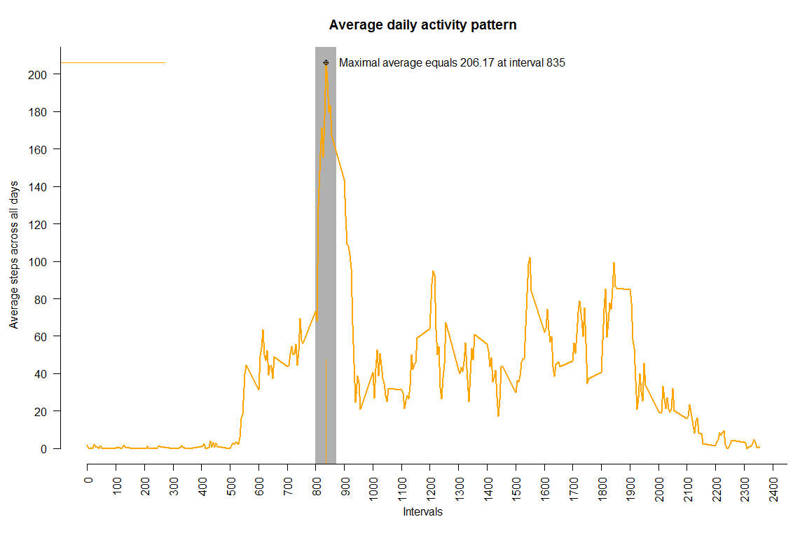
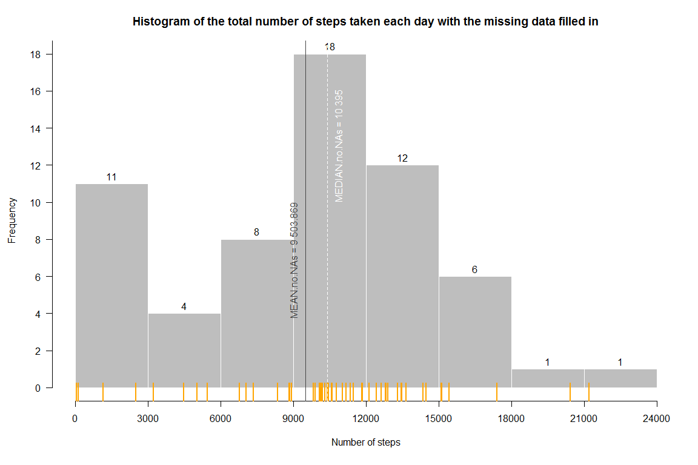
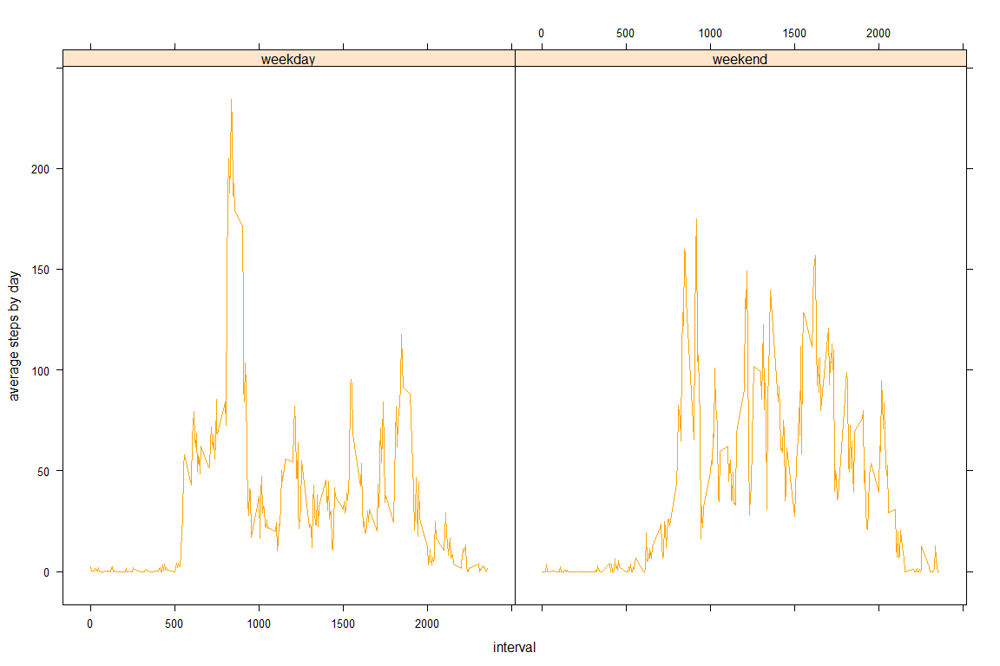

# Reproducible Research: Peer Assessment 1
Suday, January 18, 2015  

***

#### Loading and preprocessing the data


For correct performance you need to load following additional libraries.


```r
library(data.table) # for all table transformations
library(lubridate)  # for dates
library(lattice)    # for plot in last task
```

Copy and unzip __activity.csv__ file to your working directory (use `getwd()` to locate).  

As a next step read the data.


```r
activity.csv <- data.table::fread("activity.csv"
                                  , sep=","
                                  , nrows=-1L
                                  , header="auto"
                                  , na.strings="NA"
                                  )
```

And convert text collumn `date` to date form.


```r
activity.csv <- activity.csv[, date := lubridate::ymd(date)]
```

***

#### What is mean total number of steps taken per day?

Following code generates:

1. A histogram of the total number of steps taken each day.
2. The mean and the median of total number of steps taken per day.

First of all prepare data.

```r
tot.nmbr.of.stps.tkn.each.day <- activity.csv[!is.na(steps) # delete NAs
                                             ][, list(tot.steps.by.day = sum(steps)) # sum steps grouped by `date`
                                               , by = list(date)
                                              ]
```

Then calculate the mean and the median...


```r
# mean
(stps.mean <- mean(tot.nmbr.of.stps.tkn.each.day[, tot.steps.by.day]))
```

```
## [1] 10766.19
```

```r
# median
(stps.medn <- median(tot.nmbr.of.stps.tkn.each.day[, tot.steps.by.day]))
```

```
## [1] 10765
```

```r
# histogram
h <- hist(tot.nmbr.of.stps.tkn.each.day[, tot.steps.by.day]
          , breaks = (0:8)*3000
          , plot = FALSE
          )
```

...and draw the plot.


```r
# for plotting nice figure
par(mar = c(5, 4, 3, 1) + 0.5, las = 1)
plot(h 
     , col = "grey"
     , border = "white"
     , axes = FALSE
     , labels = TRUE
     , main = "Histogram of the total number of steps taken each day"
     , xlab = "Number of steps"
     )
axis(side=1
     , at=(0:8)*3000
     , labels = (0:8)*3000
     )
axis(side = 2
     , at = seq(0, max(h$counts)*1.2, 2)
     , labels = seq(0, max(h$counts)*1.2, 2)
     , las = 1
     )
rug(tot.nmbr.of.stps.tkn.each.day[, tot.steps.by.day]
    , side = 1
    , col = "orange"
    , lwd = 2
    , ticksize = 0.05
    )
abline(v = stps.mean
       , col = "grey27"
       , lty = "solid"
       )
text(x = stps.mean
     , y = 10
     , labels = paste("MEAN =", format(stps.mean, big.mark = "\ "), sep = " ")
     , cex = 1.0
     , pos = 2
     , srt = 90
     , col = "grey27"
     , offset = 1.0
     )
abline(v = stps.medn
       ,col = "white"
       ,lty = "dashed"
       )
text(x = stps.medn
     , y = 10
     , labels = paste("MEDIAN =", format(stps.medn, big.mark = "\ "), sep = " ")
     , cex = 1.0
     , pos = 4
     , srt = 90
     , col = "white"
     , offset = 1.0
     )
```

 

***

#### What is the average daily activity pattern?

Prepare data set and calculate additional variables


```r
average.daily.activity.pattern <- activity.csv[!is.na(steps) # delete NAs
                                              ][, list(avg.dly.act.ptrn = mean(steps)) # mean steps grouped by `interval` 
                                                , by = list(interval)
                                                ]
```


```r
#  maximal average number of steps (y-axis)
(MY <- max(average.daily.activity.pattern[, avg.dly.act.ptrn]))
```

```
## [1] 206.1698
```

```r
# interval with maximal average number of steps (x-axis)
(MX <- average.daily.activity.pattern[avg.dly.act.ptrn == MY, interval])
```

```
## [1] 835
```

Draw plot for the average daily activity pattern


```r
par(mar = c(5, 4, 3, 1) + 0.5, las = 1)
plot(average.daily.activity.pattern[, interval]
      , average.daily.activity.pattern[, avg.dly.act.ptrn]
      , type = "l"
      , col  = NULL
      , lty  = 1
      , lwd  = 2
      , axes = FALSE
      , main = "Average daily activity pattern"
      , xlab = "Intervals"
      , ylab = "Average steps across all days"
      )  
abline(v = MX # area with max value is highlighted by grey background rectangle
       ,col = "grey69"
       ,lty = "solid"
       , lwd  = 30
       )
rug(MX
    , side = 1
    , col = "orange"
    , lwd = 1
    , ticksize = 0.25
    )
rug(MY
    , side = 2
    , col = "orange"
    , lwd = 1
    , ticksize = 0.25
    )
axis(side=1
     , at = seq(0, max(average.daily.activity.pattern[, interval]) * 1.1, 100)
     , labels = seq(0, max(average.daily.activity.pattern[, interval]) * 1.1, 100)
     , las = 2
     )
axis(side=2
     , at = seq(0, MY * 1.2, 20)
     , labels = seq(0, MY * 1.2, 20)
     , las = 1
     )
lines(average.daily.activity.pattern[, interval]
      , average.daily.activity.pattern[, avg.dly.act.ptrn]
      , type = "l"
      , col  = "orange"
      , lty  = 1
      , lwd  = 2
      )  
points(x = MX
       , y = MY
       , pch = 10
       )
text(x = MX
     , y = MY
     , labels = paste("Maximal average equals"
                      , format(MY, big.mark = "\ ", digits = 6)
                      , "at interval"
                      , format(MX, big.mark = "\ ")
                      , sep = " "
                      )
     , cex = 1.0
     , pos = 4
     , offset = 1.0
     )
```

 

***

#### Imputing missing values

To calculate and report the total number of missing values in the dataset (i.e. the total number of rows with `NA`) use one of following codes:

One way...


```r
summary(activity.csv[, steps])
```

```
##    Min. 1st Qu.  Median    Mean 3rd Qu.    Max.    NA's 
##    0.00    0.00    0.00   37.38   12.00  806.00    2304
```

...or another


```r
nrow(activity.csv[is.na(steps)])
```

```
## [1] 2304
```

***

Strategy for filling in all of the missing values in the dataset goes as follows:

First of all select no NA observations from `activity.csv` and calculate `median()` in each group designated by `interval`.


```r
method.for.NAs <- activity.csv[!is.na(steps) # delete NAs
                               ][, list(steps = median(steps))
                                 , by = list(interval)
                                 ]
```

Splits `activity.csv` in two


```r
good.obs <- activity.csv[!is.na(steps)] # the good(no NA), the bad(NA) and the ugly(NA replaced) :-)
bad.obs  <- activity.csv[ is.na(steps)][, steps := NULL] # delete column 'steps'   
```

Perform "left join" to input missing values substitutes


```r
setkey(bad.obs, interval)
setkey(method.for.NAs, interval)

ugly.obs <- method.for.NAs[bad.obs] # NAs replaced
```

Bind two sets into __new__ dataset that is equal to the original dataset but with the missing data filled in.


```r
activity.csv.no.NAs <- rbindlist(list(good.obs, ugly.obs), use.names=TRUE, fill=TRUE)
```

Code below prepares data for plotting... 


```r
tot.nmbr.of.stps.tkn.each.day.no.NAs <- activity.csv.no.NAs[, list(tot.steps.by.day = sum(steps))
                                                            , by = list(date)
                                                            ]
# no NAs mean
(stps.mean.no.NAs <- mean(tot.nmbr.of.stps.tkn.each.day.no.NAs[, tot.steps.by.day]))
```

```
## [1] 9503.869
```

```r
# no NAs median
(stps.medn.no.NAs <- median(tot.nmbr.of.stps.tkn.each.day.no.NAs[, tot.steps.by.day]))
```

```
## [1] 10395
```

```r
# histogram
h.no.NAs <- hist(tot.nmbr.of.stps.tkn.each.day.no.NAs[, tot.steps.by.day]
                 , breaks = (0:8)*3000
                 , plot = FALSE
                 )
```

...and do the plotting


```r
# the same "plotting strategy" as for the first histogram
par(mar = c(5, 4, 3, 1) + 0.5, las = 1)
plot(h.no.NAs
     , col = "grey"
     , border = "white"
     , axes = FALSE
     , labels = TRUE
     , main = "Histogram of the total number of steps taken each day with the missing data filled in"
     , xlab = "Number of steps"
     )
axis(side=1
     , at=(0:8)*3000
     , labels = (0:8)*3000
     )
axis(side = 2
     , at = seq(0, max(h.no.NAs$counts)*1.2, 2)
     , labels = seq(0, max(h.no.NAs$counts)*1.2, 2)
     , las = 1
     )
rug(tot.nmbr.of.stps.tkn.each.day.no.NAs[, tot.steps.by.day]
    , side = 1
    , col = "orange"
    , lwd = 2
    , ticksize = 0.05
    )
abline(v = stps.mean.no.NAs
       , col = "grey27"
       , lty = "solid"
       )
text(x = stps.mean.no.NAs
     , y = 10
     , labels = paste("MEAN.no.NAs =", format(stps.mean.no.NAs, big.mark = "\ "), sep = " ")
     , cex = 1.0
     , pos = 2
     , srt = 90
     , col = "grey27"
     , offset = 1.0
     )
abline(v = stps.medn.no.NAs
       ,col = "white"
       ,lty = "dashed"
       )
text(x = stps.medn.no.NAs
     , y = 10
     , labels = paste("MEDIAN.no.NAs =", format(stps.medn.no.NAs, big.mark = "\ "), sep = " ")
     , cex = 1.0
     , pos = 4
     , srt = 90
     , col = "white"
     , offset = 1.0
     )
```

 

__Question__: 

> Do these values differ from the estimates from the first part of the assignment? 
> What is the impact of imputing missing data on the estimates of the total daily number of steps?

__Answer__: Yes, these values differ. Both mean and median decreased after replacing NAs.

statistics | values after removing NAs [$old$] | values after imputations [$new$] | percent of decrease [$\frac{(old-new)}{old}$]
-|-|-|-
mean   | 10 766.19 | 9 503.869 | 11.72%
median | 10 765 | 10 395 | 3.44%

***

#### Are there differences in activity patterns between weekdays and weekends?

Create new factor variable for weekdays nad weekends


```r
# make sure that those two variables are not in the set, warning may appear
activity.csv <- activity.csv[, `:=`(weekday=NULL, weekday_weekday=NULL) ] 

# create variable
activity.csv <- activity.csv[!is.na(steps) # delete NAs
                             ][, weekday := wday(date, label = F) # create temporary variable
                              ][, weekday_weekday := as.factor(ifelse(!(weekday == 1 | weekday == 7), 'weekday', 'weekend')) # new variable for weekdays nad weekends
                               ][, weekday := NULL # drop temporary variable
                                ]
```

Prepare set for ploting


```r
average.steps.in.weekdays.and.weekends <- activity.csv[, list(avg.steps.by.day = mean(steps))
                                                            , by = list(interval, weekday_weekday)
                                                            ]
```

__Question__: 

> Are there differences in activity patterns between weekdays and weekends?

__Answer__: Yes, patterns are different.
For example graph for `weekend` group is more symetric while `weekday` is left skew. 


```r
xyplot(avg.steps.by.day~interval|weekday_weekday
       , data = average.steps.in.weekdays.and.weekends
       , type = c("l")
       , ylab = "average steps by day"
       , col = "orange"
       )
```

 

***

__The End__

Thank you for your time and attention
